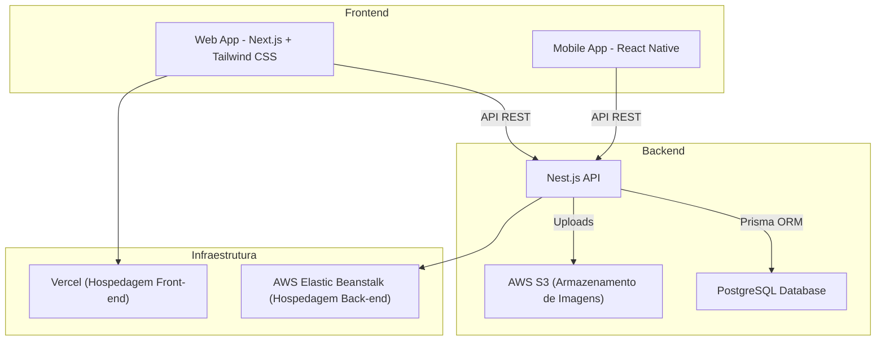

# Objetivos do Sistema

## Arquitetura do Sistema

```mermaid
flowchart TD

  %% Front-end
  subgraph Frontend
    FEWeb["Web App - Next.js + Tailwind CSS"]
    FEMobile["Mobile App - React Native"]
  end

  %% Back-end
  subgraph Backend
    API["Nest.js API"]
    DB["PostgreSQL Database"]
    S3["AWS S3 (Armazenamento de Imagens)"]
  end

  %% Infraestrutura
  subgraph Infraestrutura
    Vercel["Vercel (Hospedagem Front-end)"]
    Beanstalk["AWS Elastic Beanstalk (Hospedagem Back-end)"]
  end

  %% Conexões
  FEWeb -->|API REST| API
  FEMobile -->|API REST| API

  API -->|Prisma ORM| DB
  API -->|Uploads| S3

  FEWeb --> Vercel
  API --> Beanstalk
```
